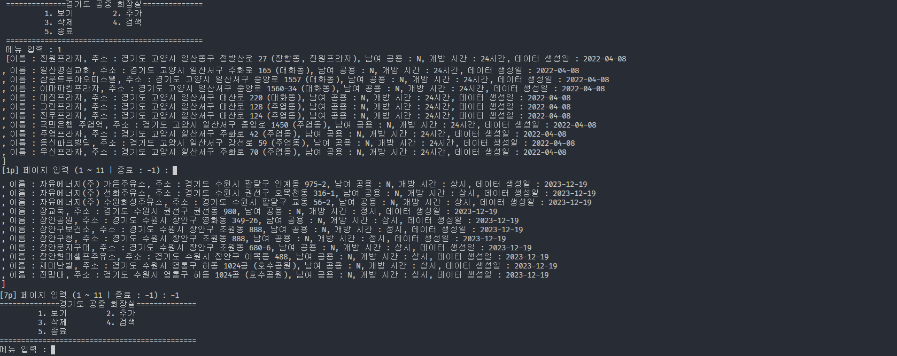
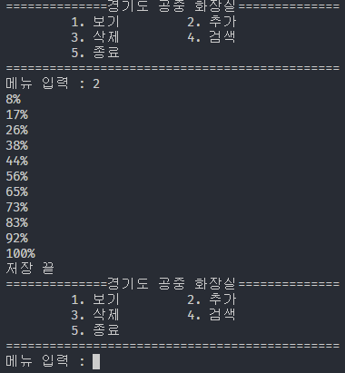
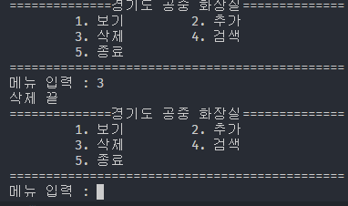
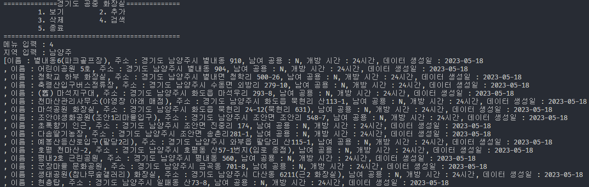

# 경기도 공공화장실 API

## 정보
- **프로젝트 기간 :** 2024.5.20 ~ 2024.5.22
- **개발 언어 :** Java

&nbsp;

## 개요

경기도에서 제공하는 공공데이터 API를 활용해 경기도에 존재하는 공공 화장실 정보를 XML 형식으로 받아와 PublicToilet 객체 목록으로 파싱해 전체보기, Database에 저장, 삭제, 검색 기능을 제공합니다.

&nbsp;

## 기능

### 전체 보기

공공 화장실 전체 목록을 확인할 수 있습니다.

페이지당 1,000개의 데이터를 불러옵니다.

&nbsp;

### 추가

목록을 1,000개로 나누어 Database에 저장합니다.

&nbsp;

### 삭제

Database에 저장되어있는 공공화장실 데이터를 모두 삭제합니다.

&nbsp;

### 검색

Database에 저장되어있는 목록을 바탕으로 지역별로 검색합니다.
